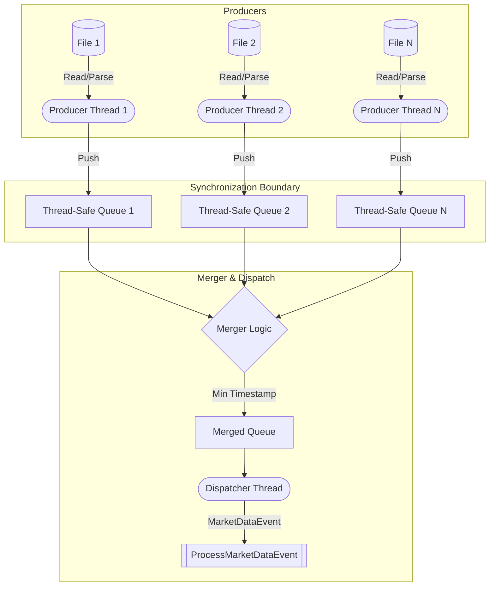
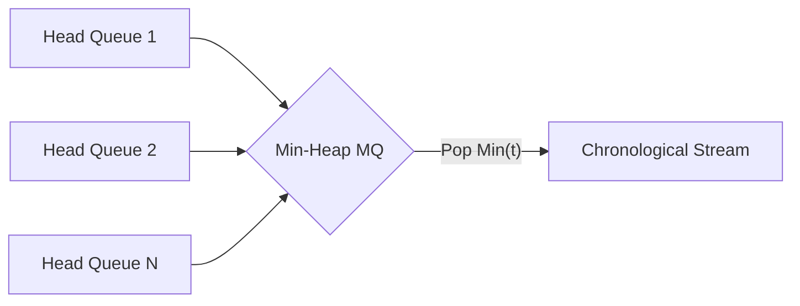
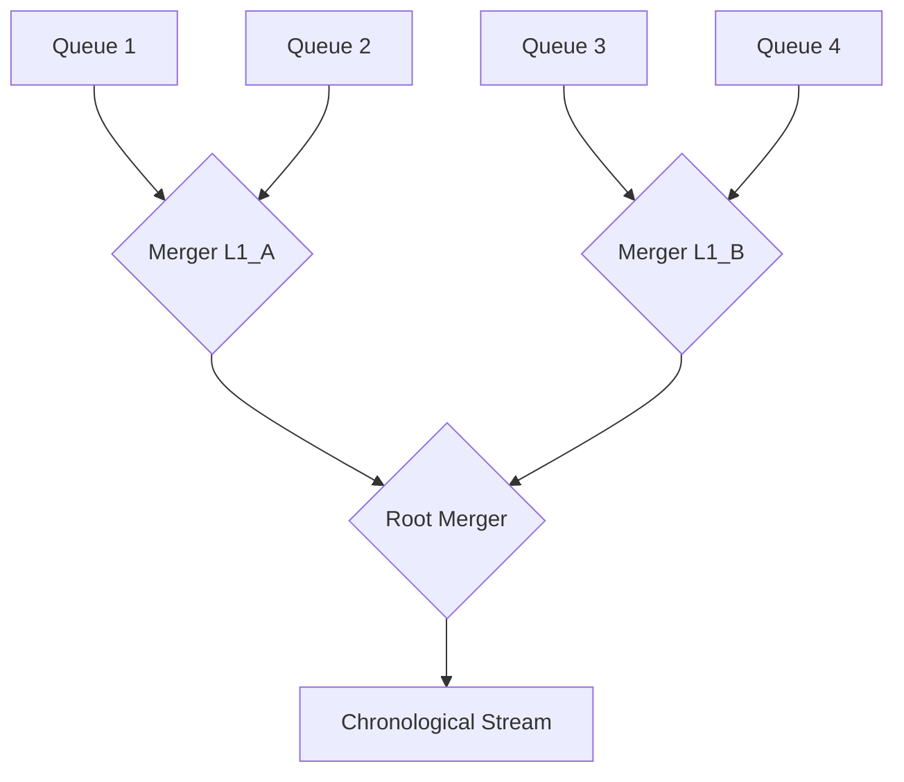

### Logical Steps

1.  **File Partitioning (Initialization):** Identify the ~20 daily NDJSON files.
Allocate a distinct producer thread to each file to ensure I/O and parsing
workloads are isolated.
2.  **Message Parsing (Producers):** Each producer thread reads its assigned
file, parses the NDJSON strings into lightweight intermediate structures,
and pushes them into an associated thread-safe queue. 
3.  **Stream Merging (Merger):** The system continuously monitors the heads of
all $N$ queues. It extracts the message with the absolute minimum timestamp
across all active queues and pushes it to a single chronological dispatch queue.
4.  **Event Dispatching (Consumer):** A singular dispatcher thread consumes the
merged queue. It constructs the `MarketDataEvent` and sequentially invokes
`ProcessMarketDataEvent` to update the Limit Order Book (LOB). Sequential
execution here is mandatory to maintain LOB state determinism.

### Parallelism Concepts

The system operates on an Multiple-Producers, Single-Consumer (MPSC) paradigm
combined with $K$-way stream synchronization.
*   **Data Parallelism:** File parsing is highly parallelizable. Threads perform
CPU-bound JSON deserialization independently.
*   **Synchronization Primitives:** Producer queues require thread-safe
insertions and non-blocking (or minimally blocking) reads. Condition variables
and mutexes manage backpressure, preventing memory exhaustion if producers
outpace the dispatcher.
*   **Time-Series Alignment:** Parallel streams of chronological data form a
directed acyclic graph of events. The merger acts as a topological sort based
on the timestamp vector, ensuring the dispatcher reconstructs the correct global
temporal sequence.

### Architectural Diagrams

**1. General System Architecture**

**2. Flat Merger Strategy**
Applies a single multi-stream priority queue (min-heap structure). Complexity
for extracting the next event is $O(\log K)$, where $K$ is the number of active
streams.

**3. Hierarchy Merger Strategy**
Constructs a binary or quaternary reduction tree. Pairs of streams are merged
iteratively. This structure allows intermediate merges to operate concurrently,
shifting merge workloads from a single bottleneck to multiple parallel nodes.

### C++ Parallelism Resources

To implement these constructs, utilize the following references and libraries:
*   `std::thread` and `std::jthread` (C++20) for thread lifecycle management.
*   `std::mutex`, `std::condition_variable`, and `std::shared_mutex` for
blocking synchronization and signaling.
*   `std::priority_queue` combined with custom comparators for min-heap
implementations.
*   **moodycamel::ConcurrentQueue**: A highly efficient, lock-free MPSC queue
implementation suitable for high-frequency trading data paths.
*   **Boost.Lockfree**: Specifically `boost::lockfree::queue` and `spsc_queue`
for bounded, wait-free ring buffers between threads.
*   **Intel Threading Building Blocks (OneTBB)**: For advanced concurrent
containers (`tbb::concurrent_queue`) and task-based parallelism patterns.